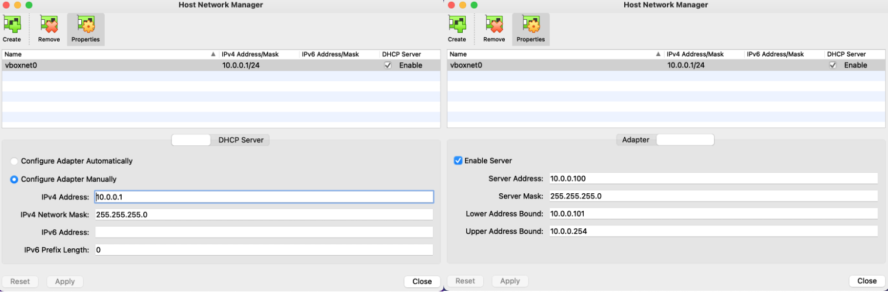

**:heart: Kindly support by giving :star:**
># Kubernetes cluster setup using Vagrant and VirtualBox
**IMPORTANT:** \
VirtualBox > File > Host Network Manager - IP series to be in 10.0.0.1.

<p align="center">

</p>

**Requirements**
```shell
$ vagrant
$ virtualbox
```
Deploy vm's
```shell
$ vagrant up
```
To access the nodes
```shell
$ vagrant ssh master
$ vagrant ssh worker01
$ vagrant ssh worker02
```
Stop vm's gracefully
```shell
$ vagrant halt
```
Terminate cluster
```shell
$ vagrant destroy -f
```
For terminating a specific node
```shell
$ vagrant destroy <NODE_NAME>
```
If you want to view the workers joining.\
_(note: After master created_)
```shell
$ vagrant ssh master
$ watch -n2 kubectl get pods -A
$ watch -n2 kubectl get nodes
```
